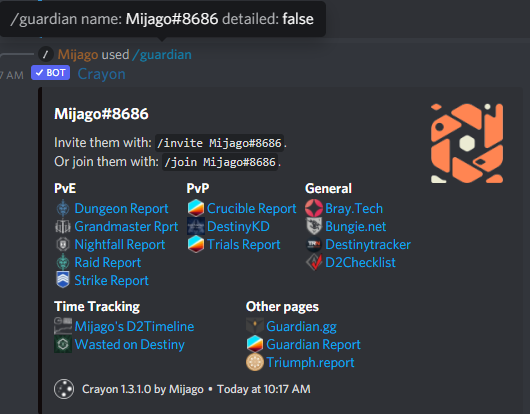

title:      Command: Guardian
desc:       Get a list of useful stat tracking pages for a guardian.
date:       2022/04/01
version:    1.3.1.0
template:   document
nav:        Command: Guardian __4__

The `guardian` command allows you to search for guardians by name.
Crayon will show you a list of many stat- and activity tracking pages, as well as detailed information of the users current loadout and activity.
Each page will link you directly to the profile of the searched guardian on the selected page.

It has the following parameters:

| Parameter | Required | Description                                                                                                                                                       |
|-----------|----------|-------------------------------------------------------------------------------------------------------------------------------------------------------------------|
| name      | Yes      | The name and Bungie-ID of the guardian you want to search. Example: `Mijago#8686`                                                                                  |
| detailed  | No       | Defaults to false. If you enable this, the bot will fetch the loadout, fireteam and activity of the guardian. This only works if the user is currently online. |

# Examples
{: .small}
{: .small}