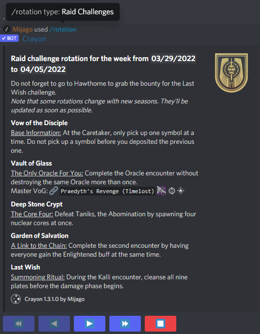
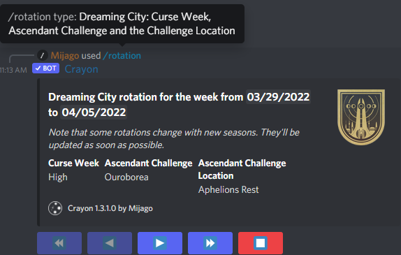

title:      Command: Rotation
desc:       Look up rotations for ingame things
date:       2022/04/01
version:    1.3.1.0
template:   document
nav:        Command: Rotation __5__

The `/rotation` command shows you various ingame rotations.
Rotation categories are:

* Nightfall: Ordeal and Weapons
* Raid Challenges
* Nightmare Hunts: Bosses and roaming Nightmare location
* Europa: Empire Hunts, Exo Challenge and the Eclipsed Zone
* Dreaming City: Curse Week, Ascendant Challenge and the Challenge Location

You can use the the buttons below the embed to look up to 10 weeks into the future.

Some rotations, especially the Nightfall category also change when the season changes and are not known until week 6 of the season.
I will try to update them as soon as I get all the information required!
{: .warning}

# Examples
{: .small}
{: .small}
{: .small}
