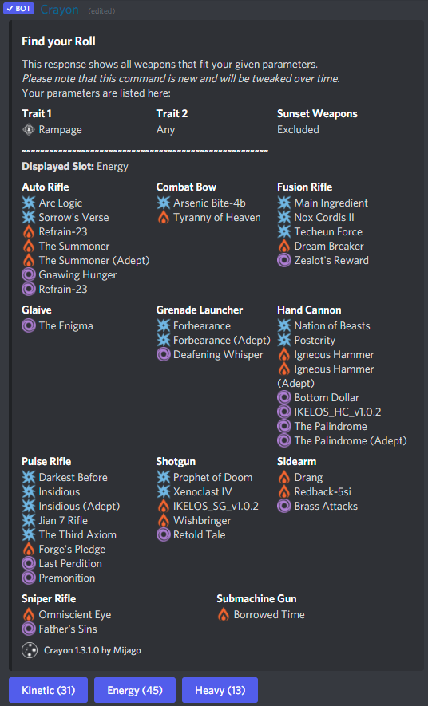
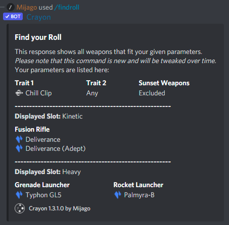

title:      Command: Find Roll
desc:       Find a weapon with a specific perk combination.
date:       2022/04/01
version:    1.3.1.0
template:   document
nav:        Command: Find Roll __3__

The `/findroll` command lets you search for items with a specific trait or a trait combination.
To further narrow your search down, you can specify the type of the weapon with three parameters (`weapon_type`, `element`, `slot`).

If you only specify one trait, you will receive a list of all weapons that can roll this perk.
Add a `trait2` and the bot will only list weapons that can roll **both** perks in **different columns**.
Sunset weapons are excluded by default.

A `Trait` is a perk in the 3rd or 4th column of a weapon.
{: .tip}

It has the following parameters:

| Parameter   | Required | Description                                                                                         |
|-------------|----------|-----------------------------------------------------------------------------------------------------|
| trait       | Yes      | The name of the first trait. Make sure to use the auto completion, as correct naming is important.  |
| trait2      | No       | The name of the second trait. Make sure to use the auto completion, as correct naming is important. |
| weapon_type | No       | The type of the weapons, for example `Sniper Rifle`, `Hand Cannon`, etc.                            |
| element     | No       | The element of the weapons.                                                                         |
| slot        | No       | The slot (`Kinetic`, `Energy`, `Heavy`) of the weapons.                                             |
| hide_sunset | No       | Perm default, sunset weapons are **excluded**. You can disable this by setting this to `No`.        |

# Examples
{: .small}
{: .small}
{: .small}
