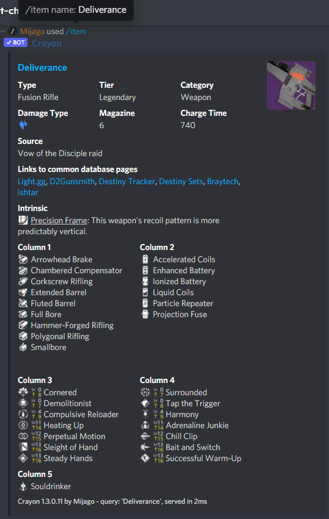
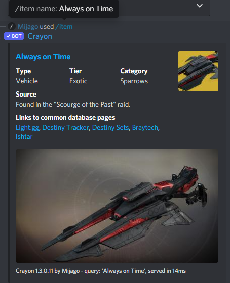
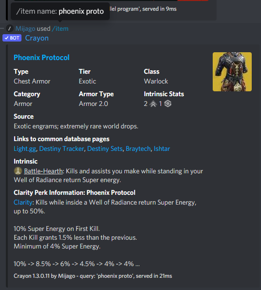
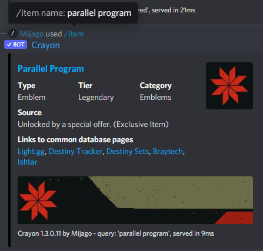
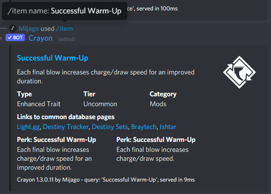

title:      Command: Item
desc:       The heart of Crayon: Search for Items, Weapons and Armor
date:       2022/04/01
version:    1.3.1.0
template:   document
nav:        Command: Item __2__

The `item` command searches the manifest for your search query and displays information for it.
This information varies for each type of item.
For Weapons it displays the weapon perks - and for craftable weapons also the level at which a perk is usable.

It has the following parameters:

| Parameter       | Required | Description                                                                                                                                                                                                                                        |
|-----------------|----------|----------------------------------------------------------------------------------------------------------------------------------------------------------------------------------------------------------------------------------------------------|
| name            | Yes      | The name of the item you want to search. It gives you an auto completion for your search query (if you are patient enough). You can also just send your query, and even if you have typos in it, it will lilely be able to find your desired item. |
| show_image      | No       | Per default, the big preview image is only shown for cosmetics. With this parameter you can enforce it for Weapons and Armor too.                                                                                                                  |
| language        | No       | The language of the search text. Defaults to English. Note that this is independent of language_result.                                                                                                                                            |
| language_result | No       | The language of the results. Defaults to English. Note that this is independent of language. You can choose one of these: English, German, Spanish, French, Italian, Polish, Russian, Brazilian Portugese                                          |

# Examples
{: .small}
{: .small}
{: .small}
{: .small}
{: .small}
