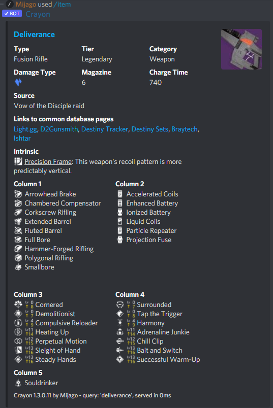
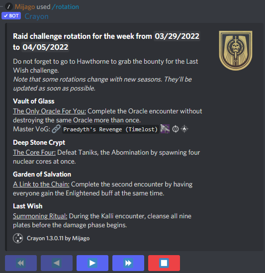

title:      Crayon by Mijago
desc:       A Discord bot for your Destiny 2 Information needs.
date:       2022/03/29
version:    1.3.1.0
template:   document
nav:        Home __-1__

Welcome to the documentation and overview of Crayon, a simple Discord bot that shows Destiny 2 information directly in Discord!
If you want to add Crayon to your server, use [this link](http://bot.d2armorpicker.com).
More information about how to add Crayon can be found [here](installation.md).
{: .info}

Crayon makes it easy to look up guardians and (almost) any Destiny 2 item, directly from your Discord chat. 
This includes Weapons, Armor, Cosmetics, Emblems - everything that is in the Destiny 2 manifest.

# Basic Features

Crayon adds the following features to your Discord server:

* You can use `/item` to search for any item in the Destiny 2 manifest.
  This also shows perks and traits for weapons and armor!
  Crayon also adds links to common database pages like Light.gg and also shows [Clarity](https://d2clarity.wordpress.com) information for perks and exotics.
* If you ever need to know all weapons with a certain perk or perk combination, use `/findweapon`! 
* You can use `/triumph` to search basic information for triumphs. 
* Look up any guardian with `/guardian`.
  You'll get the invite code and many useful web resouces to track stats!  
* If you ever wondered "What raid challenge is up right now?", just use `/rotation` to find out!
  Also contains information for Nightfalls, Nightmare Hunts and stuff on Europa and the Dreaming City.

Crayon gives you full autocompletion for all the commands, so you do not have to remember all the names!
Even if you are not patient enough to wait for the autocompletion and mistype the name, Crayon will most likely be able to find your item!
{: .tip}

# Why Crayon?
I made Crayon so I can look up weapon perks, ornaments and cosmetics directly from Discord.
If you are discussing a perk combination, you can simply search a weapon.
Crayon targets to be easy to use and to give as much information as possible.

# Examples

### The `/item` command
Note that it also shows the levels of each perk on craftable weapons!

{: .medium}
 

### The `/guardian` command
{: .medium}

### The `/rotation` command with the raid context
{: .medium}